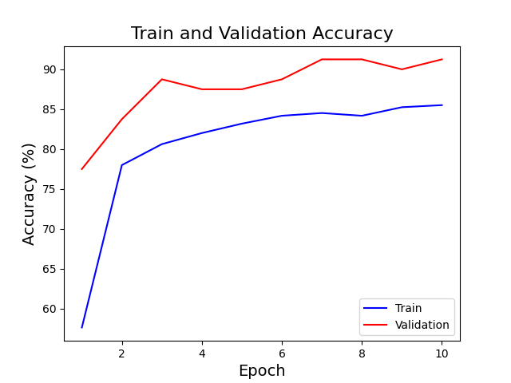

# mcv_l4_2023
# Лабораторная работа №4
## Классификкация цветов

## Теоритическая база

Inception V3 - это глубокая нейронная сеть, разработанная компанией Google в 2015 году. Она является одной из моделей семейства Inception, которые были разработаны для решения задач классификации изображений. Inception V3 использует архитектуру сверточной нейронной сети и состоит из нескольких уровней свертки, пулингов и полносвязных слоев. Модель обучалась на большом наборе данных ImageNet и показала высокую точность классификации изображений.

## Описание разработанной системы

Алгоритм работы системы
1. Установка сида в системе для повторяемости результатов.
2. Загрузка наборов изображений для обучения и валидации.
3. Запуск процесса обучения и проверки валидации модели.
4. Загрузка набора изображений для тестирования.
5. Запуск модели на загруженных изображениях для тестов.
6. Апробация результатов вычисления точности модели.

## Результаты работы и тестирования системы

Логи обучения и валидации модели

```
Epoch: [1/10], Loss: 0.1449, Train Acc: 57.63, Val Acc: 77.50
Epoch: [2/10], Loss: 0.1313, Train Acc: 77.99, Val Acc: 83.75
Epoch: [3/10], Loss: 0.1272, Train Acc: 80.62, Val Acc: 88.75
Epoch: [4/10], Loss: 0.1249, Train Acc: 82.01, Val Acc: 87.50
Epoch: [5/10], Loss: 0.1238, Train Acc: 83.19, Val Acc: 87.50
Epoch: [6/10], Loss: 0.1227, Train Acc: 84.18, Val Acc: 88.75
Epoch: [7/10], Loss: 0.1221, Train Acc: 84.52, Val Acc: 91.25
Epoch: [8/10], Loss: 0.1221, Train Acc: 84.18, Val Acc: 91.25
Epoch: [9/10], Loss: 0.1211, Train Acc: 85.25, Val Acc: 90.00
Epoch: [10/10], Loss: 0.1209, Train Acc: 85.51, Val Acc: 91.25

```
График точности модели



Результаты работы модели на тестовом наборе данных


## Выводы по работе

В процессе выполнения данной работы была обучена модель для распознования типа цветка. Для обучения была использована предобученная модель от Google InceptionV3. Она была дообучена на небольшом наборе данных для распознования некоторых типов цветков. Модель показала результат в 80% точности предсказания. Данный показатель является ожидаемым, так как для обучения модели использовался небольшой набор данных, а также модель была предобучена.
  
## Использованные источники

1. https://www.kaggle.com/datasets/alsaniipe/flowers-multiclass-datasets/data
2. https://pytorch.org/docs/stable/torch.html
3. https://cloud.google.com/tpu/docs/inception-v3-advanced
